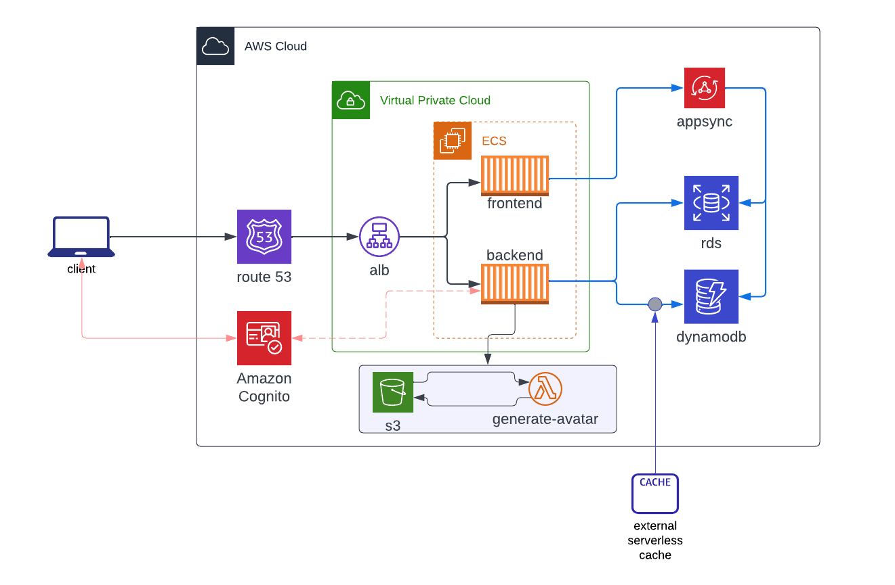
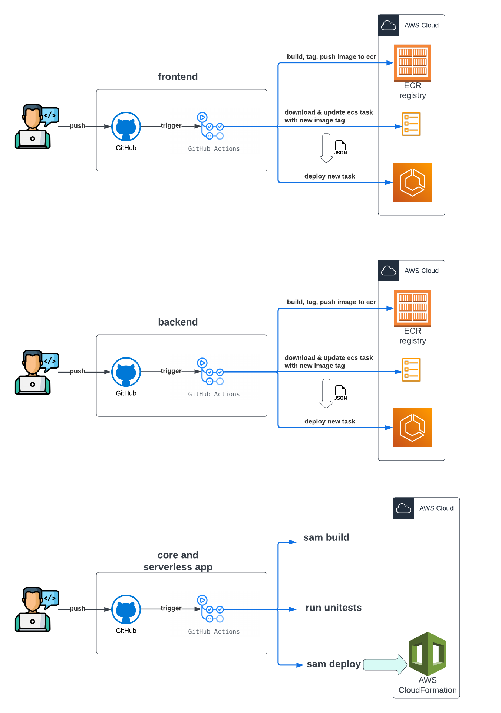

# Week 0 — Billing and Architecture

### AWS CLI and billing alarm

After initiating an AWS Account, I created an admin user with access keys, configured the AWS CLI and created a billing alarm.

Proof that aws cli is working properly and billing alarm is created:

I run this command:
```
aws cloudwatch describe-alarms --profile aws-bootcamp --region us-east-1 > journal/assets/billing-alarm.json
```
Output [here](assets/billing-alarm.json)

Already had a budget in place (was part of my org settings).

### Logical Architecture



### Reference architecture for CI/CD pipelines

For the CI/CD pipelines, I thought of 4 different workflows:
- 1 for changes to the infrastructure (vpc, alb and ecs cluster)
- 1 for changes to the frontend image
- 1 for changes to the backend image
- 1 for changes to the serverless avatar generator

