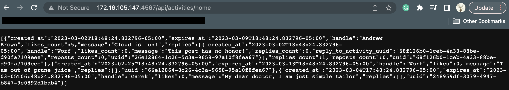
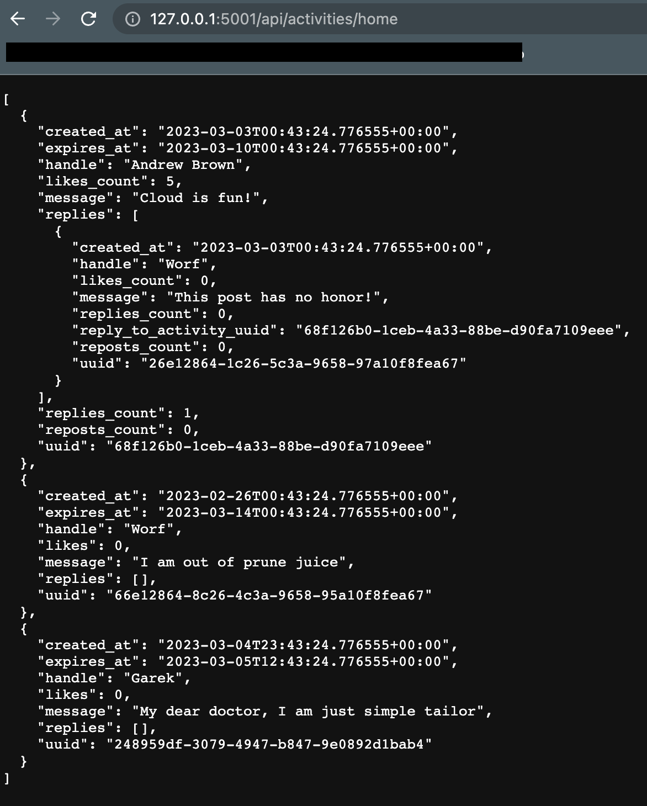
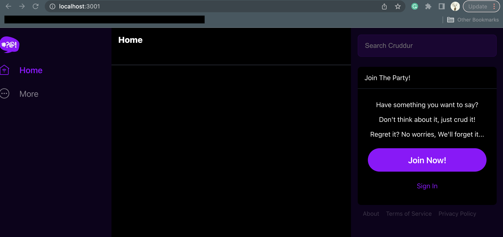

# Week 1 — App Containerization

## Containerize backend

### Run the backend locally

Python was already installed on my machine so I just created a virtual environnement to work in for the backend.

```
python -m venv venv
source venv/bin/activate
```

I installed the requirements for the container using the requirement.txt file.

```
pip install -r requirements.txt
```

Started the flask app to check for the expected output.

```
python3 -m flask run --host=0.0.0.0 --port=4567
```

Output received in the browser:



### Dockerfile and container

Created a standard Dockerfile for a flask app using python3:10-slim-buster base image.
I decided to used port 5001 to expose the app, instead of using the 4567 port suggested. This would help me dive deeper in troubleshooting, should errors occur.

```
FROM python:3.10-slim-buster

WORKDIR /backend-flask

COPY requirements.txt requirements.txt

RUN pip3 install --no-cache-dir -r requirements.txt

COPY . .

ENV FLASK_ENV=development

ENV FLASK_APP=app.py

CMD ["python3", "-m", "flask", "run", "--host=0.0.0.0", "--port=5001"]
```

The image was succesffuly built and I tested it with this command:

```
docker run -p 5001:5001 my-flask-app
```

As you might have guessed, it didn't work. A little bit of troubleshooting pointed me to the following error:
.

After inspecting the codebase, I realized that the CORS settings only allows the origins set in the code and referenced in the environment variables FRONTEND_URL and BACKEND_URL. 

I had to set those environnement variables before while starting the container:

```
export FRONTEND_URL="*"
export BACKEND_URL="*"
docker run --rm -p 5001:5001 -it  -e FRONTEND_URL -e BACKEND_URL backend-flask
```

Tested the container and I worked like when I run it locally. Good!! :)



## Containerize frontend

I've never worked with a reat app before, so I had to used some external ressource like stackoverflow and chatgpt.

Got the instructions to build the container. Here's what I did:

```
npm install # install dependencies
```

Created the Dockerfile as follow:

```
FROM node:19-alpine

COPY . .

WORKDIR /frontend-react-js

# Install dependencies
RUN npm install

ENV PORT=3001
EXPOSE 3001

CMD [ "npm", "start" ]
```
After building the image and running the container, I was able to get to this outpout.



## Docker-compose

I